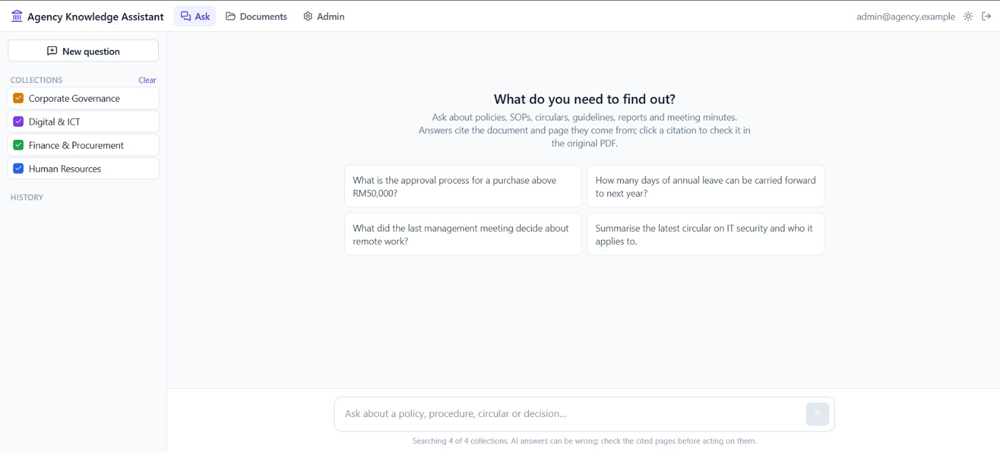
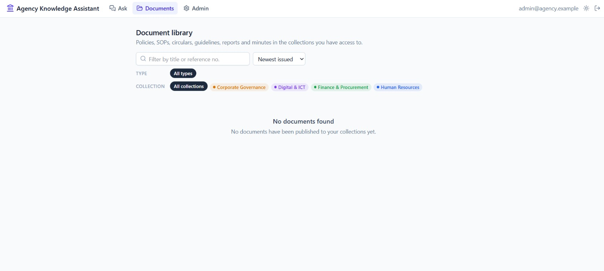
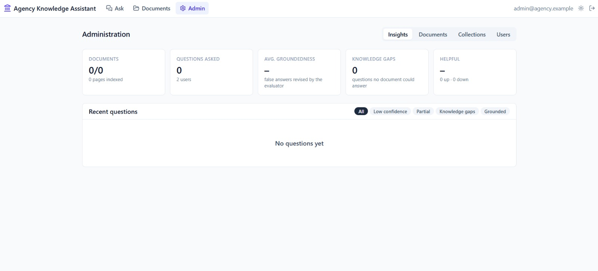

# Agency Knowledge Assistant

**Ask a question, get an answer you can verify, with every fact linked to the exact page of the policy, SOP, circular or minutes it came from.**

| Team member | Student ID |
|---|---|
| Muhammad Faiz Bin Halek | 104384313 |
| Aniq Nazhan Bin Mazlan | 104384915 |

---

## The problem

Government agencies hold thousands of documents: policies, SOPs, circulars, guidelines, reports and meeting minutes. Finding the right rule or decision usually means searching shared drives by file name and reading PDFs end to end. Answers come slowly, and officers risk acting on a circular that has since been replaced. That slows decisions and costs productivity across the agency.

## Our solution

Agency Knowledge Assistant turns an agency's document archive into a searchable knowledge base that officers can question in plain language.

- **Ask, don't search.** *"What is the approval process for a purchase above RM50,000?"* returns a direct answer drawn from the agency's own documents, not from the internet.
- **Every fact is cited.** Each sentence carries a citation chip. Clicking it opens the original PDF at the cited page, with the supporting text highlighted.
- **Answers are checked before officers rely on them.** A second AI agent checks every claim against its source. Unsupported answers are rewritten once, and if they still fail they're shown with a *Low confidence* badge instead of being presented as fact.
- **The right people see the right documents.** Documents are grouped into collections (by agency, department or topic). Each officer can search only the collections they've been granted.
- **It knows what it doesn't know.** If no document covers a question, the assistant says so instead of guessing. Admins see these questions as *knowledge gaps*, which point to missing or outdated documents.

## Screenshots

### Ask
Officers pick the collections to search and ask in plain language. Suggested questions show what the assistant can do.



### Document library
Browse every policy, SOP, circular, guideline, report and set of minutes the officer has access to. Filter by type, collection, title or reference number, newest issue first.



### Administration and insights
Admins manage documents, collections and users. The Insights view tracks documents indexed, questions asked, average groundedness, knowledge gaps and how helpful officers rated the answers.



## How it works

```
Admin uploads PDFs (type, issue date, collections)
        │
        ▼
Ingestion: extract text page by page ─► remove repeated headers/footers ─► chunk ─► embed ─► index
        │
Officer picks collections and asks a question
        │
        ▼
Query Agent ─► hybrid search (meaning + keywords, limited to the officer's collections)
        │
        ▼
Answer Agent (streams answer, cites [S1], [S2] …) ─► Evaluator Agent (checks every claim)
        ▲                                                   │
        └──────── one rewrite if any claim is unsupported ──┘
        │
        ▼
Answer with citation chips ─► click ─► PDF opens at the cited page, evidence highlighted
```

**Three cooperating AI agents**
1. **Query Agent:** rewrites follow-up questions so they stand alone, splits comparative questions ("how did the 2022 and 2024 circulars differ?") into sub-queries, and extracts keywords such as reference numbers, form numbers and acronyms.
2. **Answer Agent:** sees only the retrieved pages and must cite every factual sentence. Each excerpt arrives with its document type, reference number and issue date, and the agent flags when a later circular revises an earlier rule.
3. **Evaluator Agent:** gives each claim a verdict (supported, partial or unsupported), checks that its citation is correct, and extracts the verbatim evidence quote that the PDF viewer highlights.

**Retrieval built for government documents**
- **Hybrid search** combines meaning-based search (vector embeddings) with exact keyword search (BM25). A question in everyday words still finds the right policy, and an exact reference like *"Form DFT-512"* still matches.
- **Reliable page references:** pages are numbered by their physical position in the file, not by the printed number (which is often roman or restarts in each section), so a citation always opens the right page.
- **Whole-page context:** search matches small chunks, but the Answer Agent reads the full page, so answers aren't built from fragments.

**Access control**
- Accounts are created by admins only; there is no self sign-up. Passwords are hashed with scrypt, and logins use signed tokens.
- Every API route filters by the officer's granted collections. A question about a collection the officer isn't granted returns nothing.
- PDFs are never served publicly. Each one is opened through a short-lived signed link, issued only after the officer's access is checked.

## Technology

| Layer | Choice |
|---|---|
| Web app | React 19, Vite, Tailwind CSS, TanStack Query, react-pdf (text layer for evidence highlighting) |
| API | FastAPI (Python), pypdf, answers streamed over Server-Sent Events |
| Language models | DeepSeek API: `deepseek-v4-pro` for answers, `deepseek-flash` for query planning and evaluation |
| Embeddings | fastembed with `BAAI/bge-small-en-v1.5`, running locally on CPU |
| Data | SQLite with FTS5 keyword search; PDFs stored on local disk |

For the hackathon, everything runs on one machine. The only external call is to the language model API.

## Measuring quality

- **Live, on every answer:** the evaluator's verdict and grounded score are stored, and officers rate answers with thumbs up or down. All of this feeds the Insights dashboard.
- **Offline benchmark:** [evals/run_eval.py](evals/run_eval.py) runs a golden set of expert-written questions. It measures retrieval Recall@10 and MRR, citation accuracy, faithfulness, correctness, refusal accuracy on unanswerable questions, latency and token cost. Targets: Recall@10 ≥ 0.85, citation accuracy ≥ 0.9, refusal accuracy ≥ 0.9.
- **Value in a pilot:** time 5–10 real tasks two ways, with the assistant and by searching the shared drive manually, and compare.

## Path to production on AWS

| Prototype | Production on AWS |
|---|---|
| PDFs on local disk | Amazon S3 |
| SQLite + in-memory vector search | Amazon Aurora PostgreSQL with pgvector, or Amazon OpenSearch |
| Text-layer PDFs only | Amazon Textract for scanned circulars, tables and forms |
| Batched ingestion via the API | SQS queue with background workers |
| Local accounts | Amazon Cognito with SSO to the agency directory |
| — | Audit logging of document access, document versioning (marking superseded circulars), retention and classification controls, multilingual (Malay) embeddings |

More detail: [docs/architecture.md](docs/architecture.md) · Problem statement: [docs/problem-overview.md](docs/problem-overview.md)

---

## Running the demo

**Backend** (Python 3.12+)
```bash
cd backend
python -m venv .venv
.venv/Scripts/activate        # Windows; use `source .venv/bin/activate` elsewhere
pip install -r requirements-dev.txt
cp .env.example .env          # add your DeepSeek API key; change the demo passwords
uvicorn app.main:app --reload --port 8000
```

On first start the backend creates `backend/data/` with the SQLite database, uploaded PDFs and a signing secret. It also seeds one collection per fictional demo agency (six) and two accounts, an admin and an officer, whose credentials are in `backend/.env.example`. To reset the demo, stop the server and delete `backend/data/`. The first indexing run downloads Chroma's embedding model (all-MiniLM-L6-v2, about 80 MB). Set `EMBEDDING_PROVIDER=hash` to run fully offline.

**Frontend**
```bash
cd frontend
npm install
cp .env.example .env.local    # VITE_API_URL=/api: Vite proxies /api to the backend on :8000
npm run dev
```

Open http://localhost:5173 and sign in as the admin, then:
1. **Admin → Collections**: use the seeded collections or create your own.
2. **Admin → Documents**: upload PDFs with their type, issue date and collections, and wait for indexing to finish.
3. **Admin → Users**: add officers and choose which collections each can search.
4. **Ask**: pick collections and ask a question.

**Sample data:** `data/fake/` holds 121 fictional policies, SOPs, circulars, guidelines, reports and minutes. Load them with `cd backend && .venv/Scripts/python -m app.demo_seed`, which takes about a minute and skips documents already loaded. Regenerate them with `python scripts/generate_fake_docs.py --count 20 --out data/fake --seed 7`.

**Canary document:** named after Van Halen's "no brown M&M's" rider clause. `LAD/CIR/2025/099` is a Land Administration Department circular whose facts (Form LAD-0451, ext. 7731) appear in no other document. Ask "Which form confirms that brown sweets were removed before a contractor briefing?":
- as the admin, you should get Form LAD-0451 with a citation
- as the demo officer, who can't search that agency, you should get no answer

If either goes wrong, retrieval or access control is broken. `canary-01` and `canary-02` in `evals/golden_set.example.jsonl` check both.

**Tests**
```bash
cd backend && pytest -q       # extraction, chunking, citations, agent pipeline, access control
cd frontend && npm test       # citation parsing, evidence highlighting, streaming parser
```
