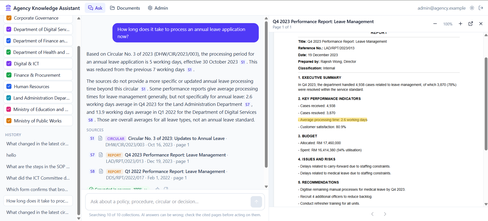
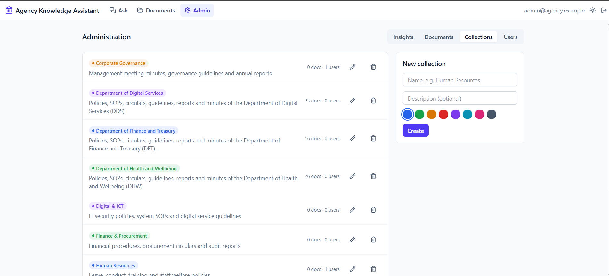
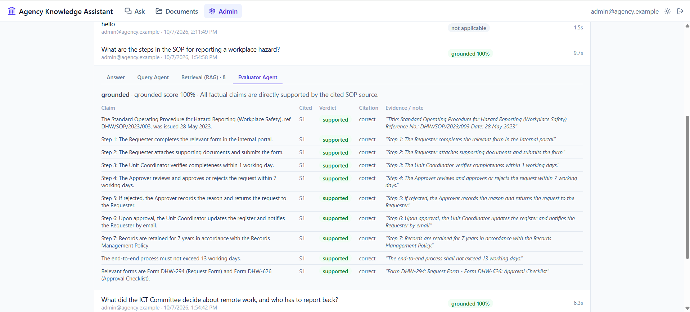

# Agency Knowledge Assistant

**Ask a question, get an answer you can verify, with every fact linked to the exact page of the policy, SOP, circular or minutes it came from.**

| Team member | Student ID |
|---|---|
| Muhammad Faiz Bin Halek | 104384313 |
| Aniq Nazhan Bin Mazlan | 104384915 |

---

## Try it live

### 👉 https://vzg3t8d6-5173.asse.devtunnels.ms/

> [!IMPORTANT]
> **The link does not open on university Wi-Fi.** The campus network blocks the tunnel. Please switch to a **mobile hotspot** (or any other network) before opening it.

Sign in with either demo account:

| Role | Email | Password | What you can see |
|---|---|---|---|
| **Admin** | `admin@agency.example` | `admin-demo-2026` | All six agencies, plus the admin pages (documents, collections, users, insights) |
| **Officer** | `officer@agency.example` | `officer-demo-2026` | Only the Department of Health and Wellbeing and the Department of Digital Services |

The app runs on our laptop and is exposed through a dev tunnel, so it is only available while we keep it running. If the link is down, the [Running it yourself](#running-it-yourself) section sets up the same demo in a few minutes. The archive is 121 **fictional** documents from six fictional agencies; no real government data is used.

### A 3-minute tour

Answers take about 10–20 seconds, because three AI agents plan, write and then fact-check each one.

1. **Ask a question** (signed in as the admin): *"What changed in the latest circular on per diem rates, and which circular does it supersede?"* Click the **[S1]** chip: the circular opens at the cited page with the supporting sentence highlighted. Click the green **Grounded in sources** badge to see the claim-by-claim fact check.
2. **Compare documents:** *"How do the Department of Health and Wellbeing and the Department of Digital Services SOPs for data classification differ in turnaround time?"* The answer cites both SOPs side by side.
3. **Ask something the archive doesn't cover:** *"What is the Director General's personal mobile number?"* The assistant says it doesn't know instead of guessing.
4. **Browse:** open **Documents** and filter by type (e.g. *Circular*) or agency, newest first. Click any document to read it.
5. **Check access control:** ask *"Which form confirms that brown sweets were removed before a contractor briefing?"* As the admin you get **Form LAD-0451**, from a Land Administration Department circular. Now sign out (top right), sign in as the **officer** and ask again. The officer has no access to that agency, so the assistant finds nothing, and the **Documents** page lists only the officer's two agencies.
6. **See the admin view:** sign back in as the admin and open **Admin → Insights**. It shows every question asked, how well grounded each answer was, and the *knowledge gaps* (questions no document could answer).

---

## The problem

Government agencies hold thousands of documents: policies, SOPs, circulars, guidelines, reports and meeting minutes. Finding the right rule or decision usually means searching shared drives by file name and reading PDFs end to end. Answers come slowly, and officers risk acting on a circular that has since been replaced. That slows decisions and costs productivity across the agency.

## Our solution

Agency Knowledge Assistant turns an agency's document archive into a searchable knowledge base that officers can question in plain language.

- **Ask, don't search.** *"What are the steps in the SOP for reporting a workplace hazard?"* returns a direct answer drawn from the agency's own documents, not from the internet.
- **Every fact is cited.** Each sentence carries a citation chip. Clicking it opens the original PDF at the cited page, with the supporting text highlighted.
- **Answers are checked before officers rely on them.** A second AI agent checks every claim against its source. Unsupported answers are rewritten once, and if they still fail they're shown with a *Low confidence* badge instead of being presented as fact.
- **The right people see the right documents.** Documents are grouped into collections (by agency, department or topic). Each officer can search only the collections they've been granted.
- **It knows what it doesn't know.** If no document covers a question, the assistant says so instead of guessing. Admins see these questions as *knowledge gaps*, which point to missing or outdated documents.

## Key features

### 1. RAG answers with the source document side by side, for human validation

The assistant answers from the agency's own documents only (retrieval-augmented generation). Every sentence carries a citation chip such as **S1**. Clicking a chip opens the original PDF **right next to the answer**, at the cited page, with the supporting sentence **highlighted**. An officer can check a claim in one click instead of trusting the AI.

In the example below, the answer quotes a 2.6-working-day average from source S7. The Q4 2023 Leave Management report is open beside it with that exact line highlighted. The source list underneath shows each document's type, reference number and issue date, so officers can tell a current circular from a superseded one.



### 2. Label-based filtering for more specialised search

Documents are tagged with **collections** (labels): an agency, a department or any other group, such as *Department of Health and Wellbeing* or *Ministry of Public Works*. The labels do two jobs:

- **Narrow the search:** on the Ask page, officers tick the collections to search (left sidebar above), so a question about health-department leave rules isn't diluted by other agencies' documents.
- **Control access:** admins grant each officer specific collections. Search, the document library and PDF links only ever return documents from granted collections, so an officer can't reach another agency's documents even by asking for them.

Admins create collections, tag documents with them and see how many documents and users each one has:



### 3. A multi-agent framework that plans, retrieves, answers and fact-checks

Each question passes through three specialised AI agents and a retrieval step, rather than a single prompt:

| Step | What it does |
|---|---|
| **Query Agent** | Rewrites the question so it stands alone, splits comparisons into sub-queries, and extracts keywords such as reference and form numbers |
| **Retrieval (RAG)** | Hybrid search of the document database: meaning (vector embeddings in ChromaDB) plus exact keywords (BM25), limited to the selected collections |
| **Answer Agent** | Writes the answer from the retrieved pages only, citing a source for every fact |
| **Evaluator Agent** | Checks every claim against its cited page: supported or not, correct citation or not, plus the verbatim evidence quote. A failing answer is rewritten once; if it still fails it is flagged *Low confidence* |

Admins can open any past question and inspect each agent's work in the Insights view: the Query Agent's plan, the pages Retrieval returned, and the Evaluator Agent's claim-by-claim verdicts. Below, all 10 claims in an SOP answer are supported and correctly cited, with the evidence quoted:



## How it works

```
Admin uploads PDFs (type, issue date, collections)
        │
        ▼
Ingestion: extract text page by page ─► remove repeated headers/footers ─► chunk ─► embed ─► index
        │
Officer picks collections and asks a question
        │
        ▼
Query Agent ─► hybrid search (meaning + keywords, limited to the officer's collections)
        │
        ▼
Answer Agent (streams answer, cites [S1], [S2] …) ─► Evaluator Agent (checks every claim)
        ▲                                                   │
        └──────── one rewrite if any claim is unsupported ──┘
        │
        ▼
Answer with citation chips ─► click ─► PDF opens at the cited page, evidence highlighted
```

**Three cooperating AI agents**
1. **Query Agent:** rewrites follow-up questions so they stand alone, splits comparative questions ("how did the 2022 and 2024 circulars differ?") into sub-queries, and extracts keywords such as reference numbers, form numbers and acronyms.
2. **Answer Agent:** sees only the retrieved pages and must cite every factual sentence. Each excerpt arrives with its document type, reference number and issue date, and the agent flags when a later circular revises an earlier rule.
3. **Evaluator Agent:** gives each claim a verdict (supported, partial or unsupported), checks that its citation is correct, and extracts the verbatim evidence quote that the PDF viewer highlights.

**Retrieval built for government documents**
- **Hybrid search** combines meaning-based search (vector embeddings) with exact keyword search (BM25). A question in everyday words still finds the right policy, and an exact reference like *"Form DFT-752"* still matches.
- **Reliable page references:** pages are numbered by their physical position in the file, not by the printed number (which is often roman or restarts in each section), so a citation always opens the right page.
- **Whole-page context:** search matches small chunks, but the Answer Agent reads the full page, so answers aren't built from fragments.

**Access control**
- Accounts are created by admins only; there is no self sign-up. Passwords are hashed with scrypt, and logins use signed tokens.
- Every API route filters by the officer's granted collections. A question about a collection the officer isn't granted returns nothing.
- PDFs are never served publicly. Each one is opened through a short-lived signed link, issued only after the officer's access is checked.

## Technology

| Layer | Choice |
|---|---|
| Web app | React 19, Vite, Tailwind CSS, TanStack Query, react-pdf (text layer for evidence highlighting) |
| API | FastAPI (Python), pypdf, answers streamed over Server-Sent Events |
| Language models | DeepSeek API: `deepseek-v4-pro` for answers, `deepseek-flash` for query planning and evaluation |
| Embeddings | ChromaDB's built-in `all-MiniLM-L6-v2`, running locally on CPU |
| Data | SQLite (documents, users, FTS5 keyword search), ChromaDB (vector index), PDFs on local disk |

For the hackathon, everything runs on one machine. The only external call is to the language model API.

## Measuring quality

- **Live, on every answer:** the evaluator's verdict and grounded score are stored, and officers rate answers with thumbs up or down. All of this feeds the Insights dashboard.
- **Offline benchmark:** [evals/run_eval.py](evals/run_eval.py) runs a golden set of expert-written questions. It measures retrieval Recall@10 and MRR, citation accuracy, faithfulness, correctness, refusal accuracy on unanswerable questions, latency and token cost. Targets: Recall@10 ≥ 0.85, citation accuracy ≥ 0.9, refusal accuracy ≥ 0.9.
- **Value in a pilot:** time 5–10 real tasks two ways, with the assistant and by searching the shared drive manually, and compare.

## Path to production on AWS

| Prototype | Production on AWS |
|---|---|
| PDFs on local disk | Amazon S3 |
| SQLite + local ChromaDB | Amazon Aurora PostgreSQL with pgvector, or Amazon OpenSearch |
| Text-layer PDFs only | Amazon Textract for scanned circulars, tables and forms |
| Batched ingestion via the API | SQS queue with background workers |
| Local accounts | Amazon Cognito with SSO to the agency directory |
| — | Audit logging of document access, document versioning (marking superseded circulars), retention and classification controls, multilingual (Malay) embeddings |

More detail: [docs/architecture.md](docs/architecture.md) · Problem statement: [docs/problem-overview.md](docs/problem-overview.md)

---

## Running it yourself

**Backend** (Python 3.12+)
```bash
cd backend
python -m venv .venv
.venv/Scripts/activate        # Windows; use `source .venv/bin/activate` elsewhere
pip install -r requirements-dev.txt
cp .env.example .env          # add your DeepSeek API key; change the demo passwords
uvicorn app.main:app --reload --port 8000
```

On first start the backend creates `backend/data/` with the SQLite database, uploaded PDFs and a signing secret. It also seeds one collection per fictional demo agency (six) and two accounts, an admin and an officer, whose credentials are in `backend/.env.example`. To reset the demo, stop the server and delete `backend/data/`. The first indexing run downloads Chroma's embedding model (all-MiniLM-L6-v2, about 80 MB). Set `EMBEDDING_PROVIDER=hash` to run fully offline.

**Frontend**
```bash
cd frontend
npm install
cp .env.example .env.local    # VITE_API_URL=/api: Vite proxies /api to the backend on :8000
npm run dev
```

Load the 121 sample documents (about a minute), then open http://localhost:5173 and sign in with the accounts in [Try it live](#try-it-live):
```bash
cd backend && .venv/Scripts/python -m app.demo_seed
```

To add your own documents:
1. **Admin → Collections**: use the seeded collections or create your own.
2. **Admin → Documents**: upload PDFs with their type, issue date and collections, and wait for indexing to finish.
3. **Admin → Users**: add officers and choose which collections each can search.
4. **Ask**: pick collections and ask a question.

**Sample data:** `data/fake/` holds 121 fictional policies, SOPs, circulars, guidelines, reports and minutes. The seed command skips documents that are already loaded. Regenerate them with `python scripts/generate_fake_docs.py --count 20 --out data/fake --seed 7`.

**Canary document:** named after Van Halen's "no brown M&M's" rider clause. `LAD/CIR/2025/099` is a Land Administration Department circular whose facts (Form LAD-0451, ext. 7731) appear in no other document. Ask "Which form confirms that brown sweets were removed before a contractor briefing?":
- as the admin, you should get Form LAD-0451 with a citation
- as the demo officer, who can't search that agency, you should get no answer

If either goes wrong, retrieval or access control is broken. `canary-01` and `canary-02` in `evals/golden_set.example.jsonl` check both, and step 5 of the tour above shows it live.

**Tests**
```bash
cd backend && pytest -q       # extraction, chunking, citations, agent pipeline, access control
cd frontend && npm test       # citation parsing, evidence highlighting, streaming parser
```
